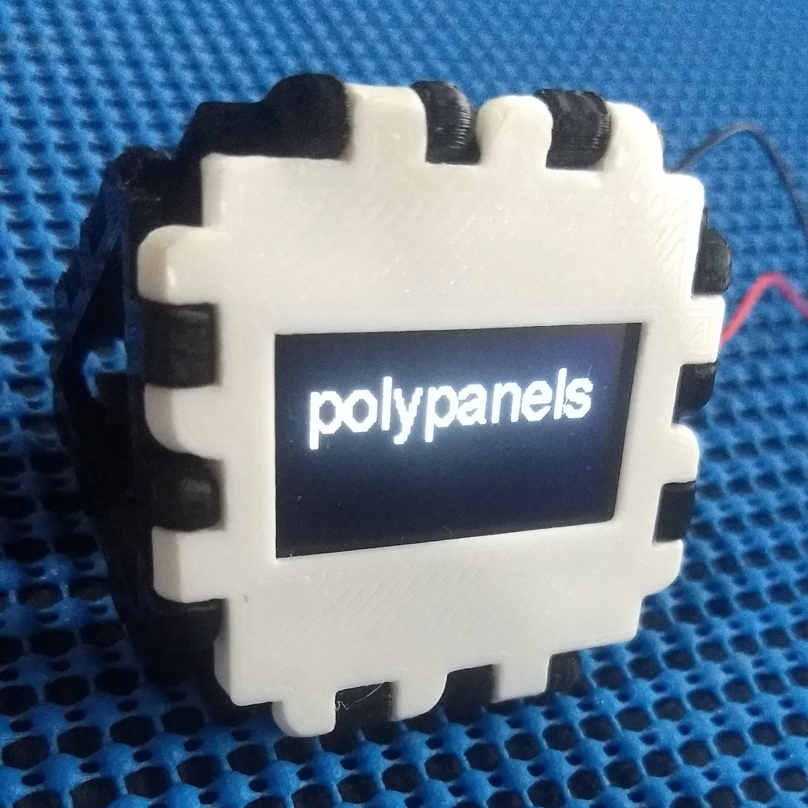
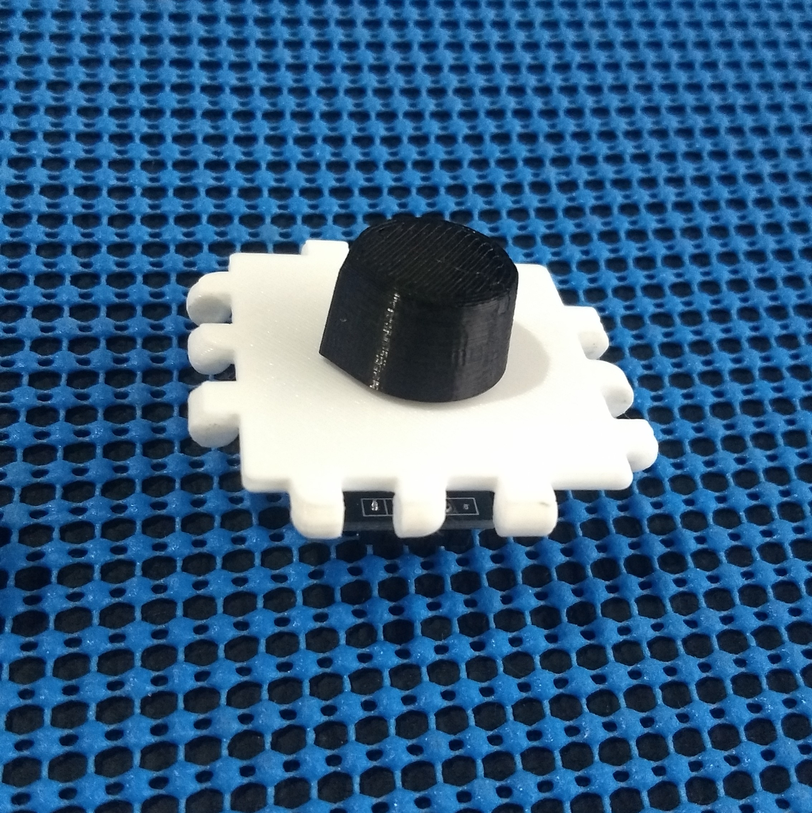

# Polypanels

Welcome to the world of Polypanels, a system of snap together parts that let your build whatever you want! It’s like an open ended construction toy for making functional things, harnessing the power of 3D printing and the community to make it truly limitless. This page will teach you the basics of Polypanels to get you started making anything.

Polypanels wan design by [makeanything][1]

## Designs

### Oled Display 

### Encoder Decoder KY-040 

## MyMiniFactory

https://www.myminifactory.com/users/ricaun

[1]: https://www.makeanything.design/polypanels