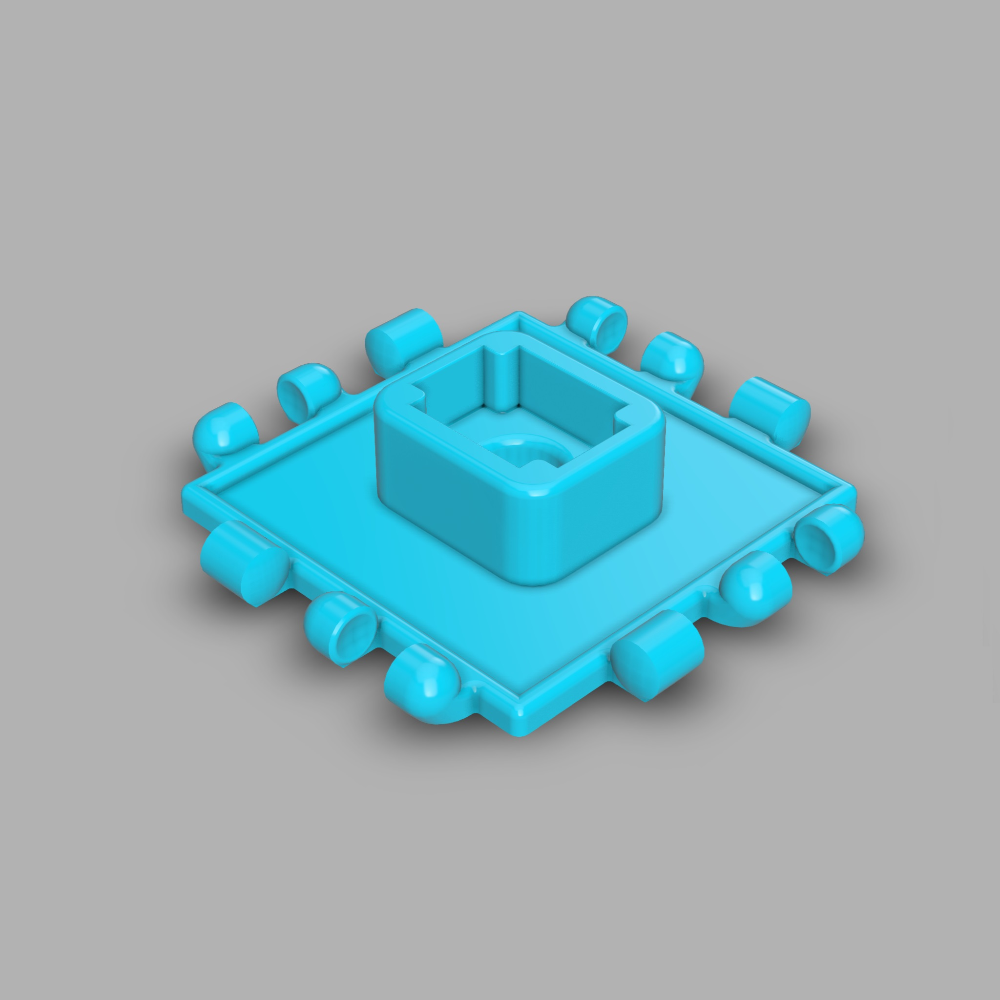
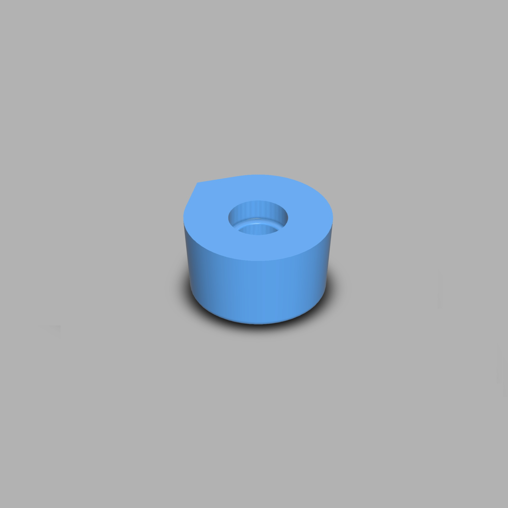
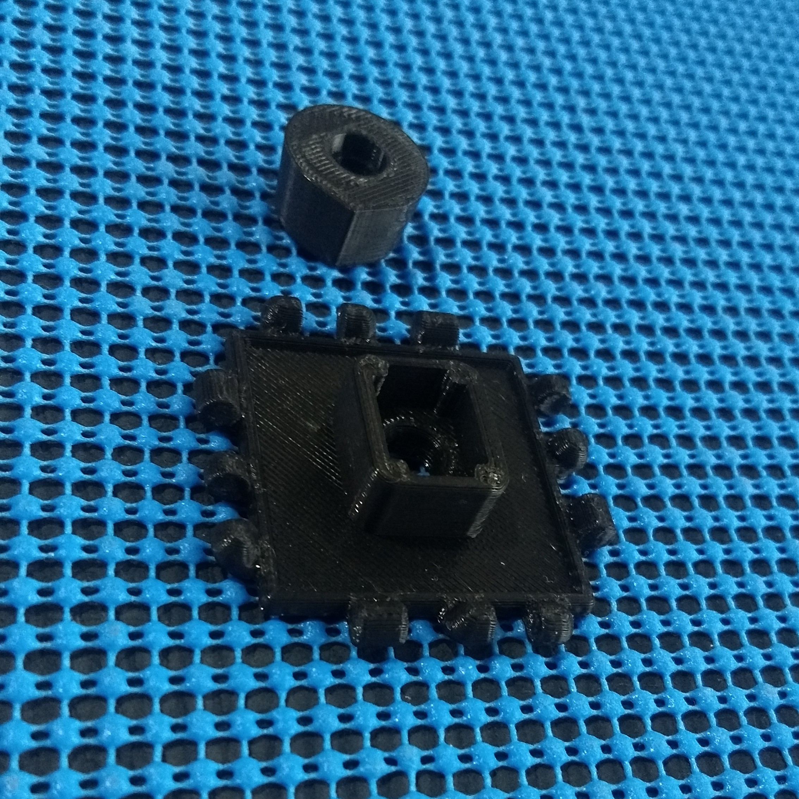
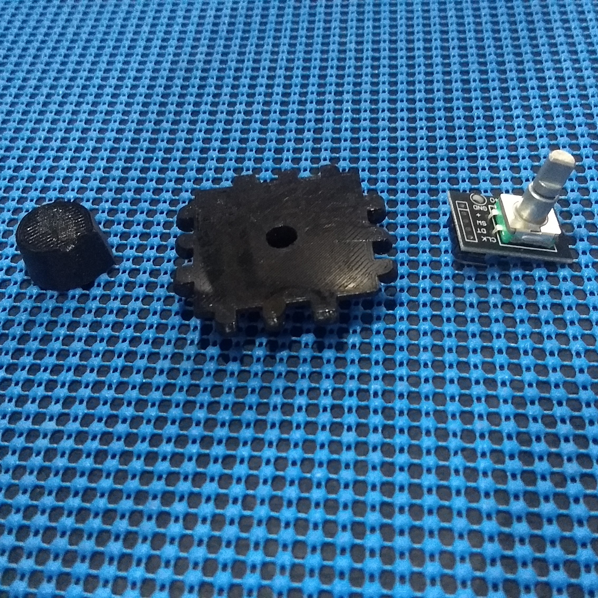
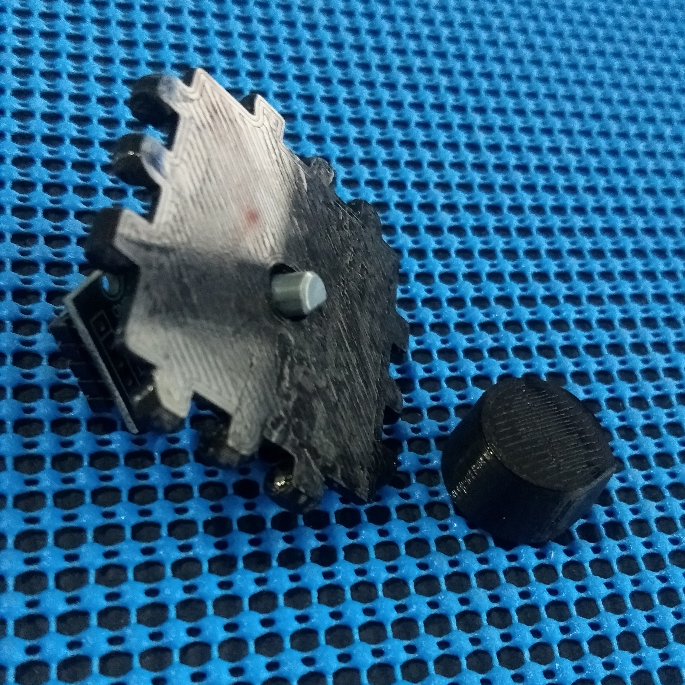
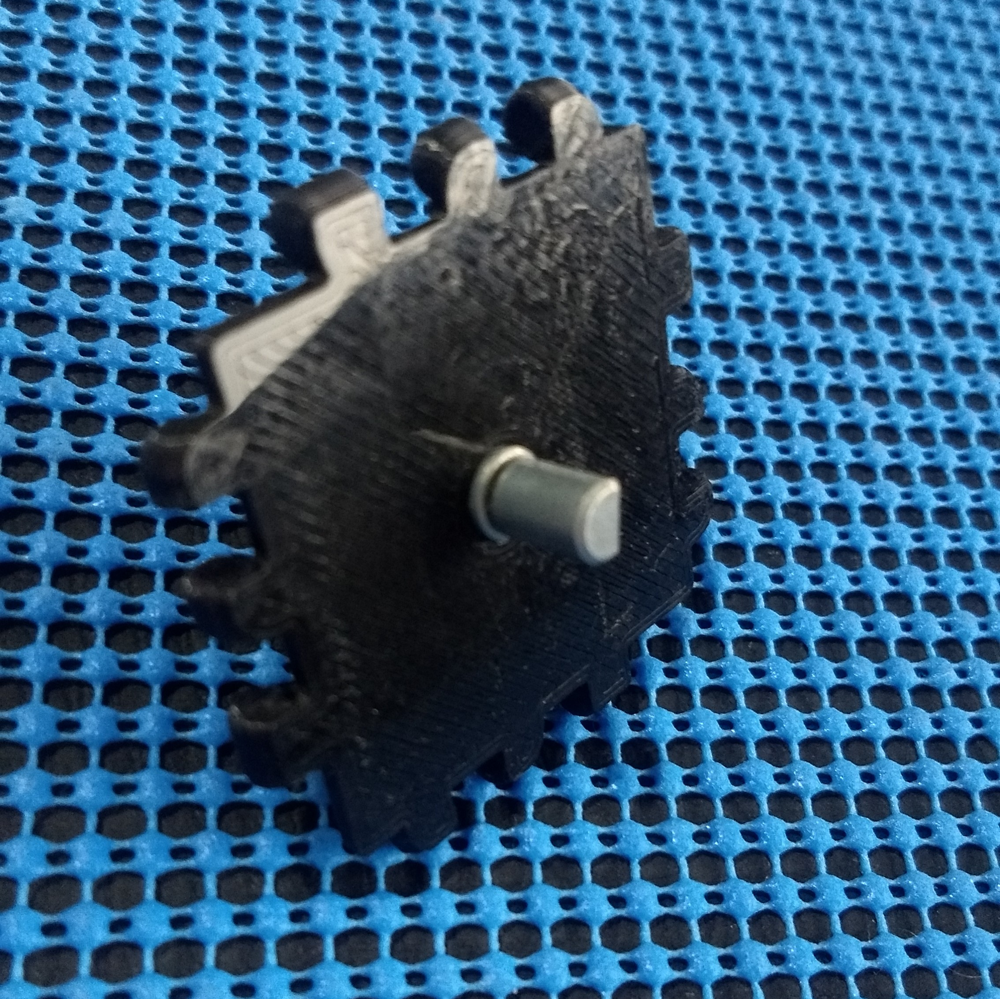
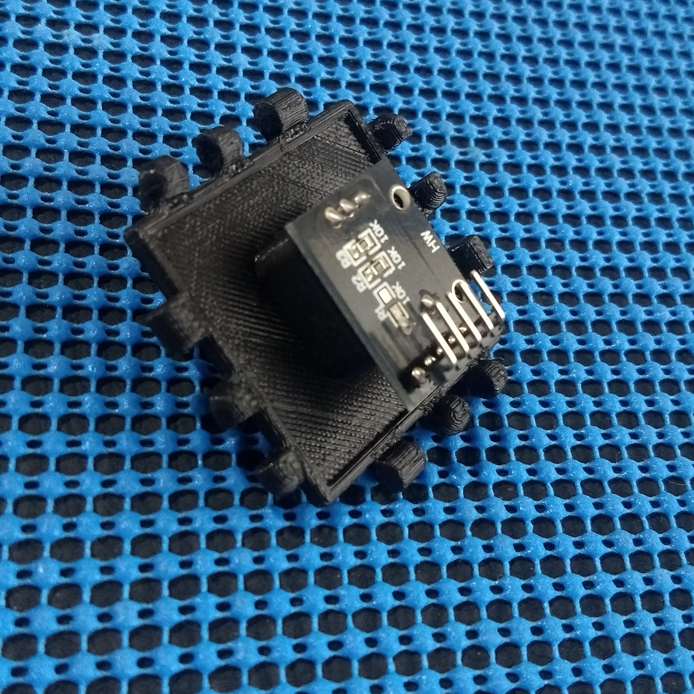
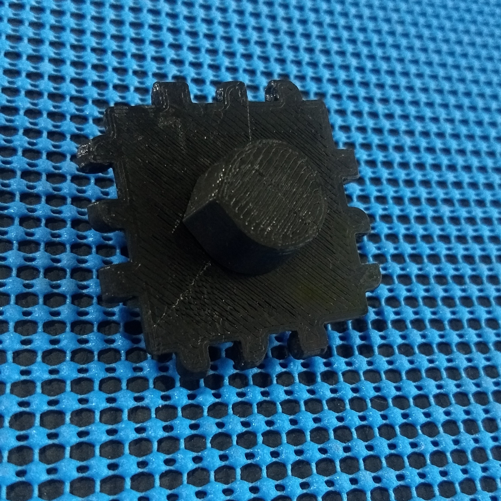

# Polypanels Encoder

This Polypanel was designed to fit an Encoder Decoder Ky-040 and can be controlled by a microcontroller (like Esp8266).

## Download STL

You can download the STL files on [myminifactory][0]. 

* [Download STL files][1]

## Downlaod Fusion

You can download the fusion file:

* [square-encoder][2]
* [encoder-top][3]

## Images

[0]: https://www.myminifactory.com/users/ricaun
[1]: https://www.myminifactory.com/object/3d-print-polypanels-encoder-92257
[2]: https://a360.co/2PyEMZo
[3]: https://a360.co/2PAsn7d
